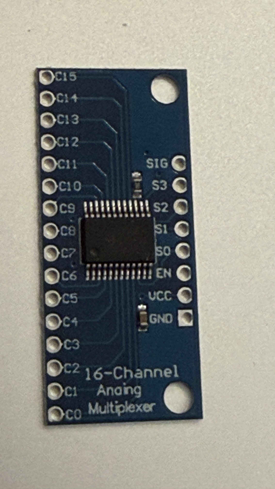

# VORTEX AX-128

**4 Layer Analog Modeling Music Station**  
**ANALOG eXTENDED LAYER SYNTHESIZER — ANALOG FILTER • WAVE LAYER**

VORTEX AX-128 is an ESP32-S3 hardware instrument built around a repurposed ExpertKeys/Tipro EK-128 key matrix, four simultaneous sound layers, four dedicated DAC channels and four independent analog filters.

## Current status

- Freenove ESP32-S3 N16R8 validated at 240 MHz with 16 MB Flash and 8 MB PSRAM.
- EK-128 reverse engineered as an 8 × 16 matrix with per-key diodes.
- All 128 EK-128 keys reported working with press and release events through the CD74HC4067 scanner (2026-10-02).
- A1 and A2 were also validated earlier with overlapping presses using direct GPIO scanning.
- Physical key-to-coordinate labels, overlapping presses through the mux, and mux temperature after correcting reversed VCC/GND remain to be checked.

## Repository map

| Path | Purpose |
|---|---|
| `docs/` | Authoritative architecture, hardware, DSP and test documentation |
| `firmware/` | Tested sketches, active prototypes and future scanner code |
| `schematics/` | Mermaid source diagrams |
| `assets/` | Privacy-safe project photos, screenshots and visual references |
| `archive/` | Earlier monolithic project notes retained for history |
| `PROJECT_MANIFEST.json` | Machine-readable project baseline and active milestone |

For future work, first read [`PROJECT_CONTEXT.md`](PROJECT_CONTEXT.md), then [`docs/00_PROJECT_HANDOFF.md`](docs/00_PROJECT_HANDOFF.md). Read [`docs/02_FROZEN_DECISIONS.md`](docs/02_FROZEN_DECISIONS.md) before changing pin assignments or architecture.

## Prototype discipline

Every hardware step has four parts:

1. prepare one bounded firmware or wiring change;
2. compile before the bench test;
3. save serial output and screenshots under `assets/test_evidence/`;
4. update the test log and commit the result.

See [`CONTRIBUTING.md`](CONTRIBUTING.md) for naming and evidence rules.

## Privacy and third-party material

Photos committed under `assets/` have been checked for location metadata. Original high-resolution photos remain local and are intentionally excluded from Git.

External repositories and visual references are research inputs, not vendored dependencies. Their code and assets retain their own licenses. See [`THIRD_PARTY_NOTICES.md`](THIRD_PARTY_NOTICES.md) and [`docs/15_OPEN_SOURCE_DSP_RESEARCH.md`](docs/15_OPEN_SOURCE_DSP_RESEARCH.md).
