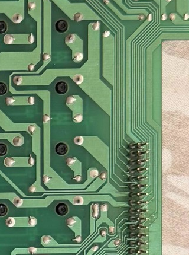

# 18 — EK-128 J1 Pin-by-Pin Wiring

This is the single wiring table for the 32-pin `J1` connector between the EK-128 keyboard PCB and the VORTEX scanner.

> The original Tipro/ExpertKeys controller must remain disconnected while the ESP32-S3 scanner is connected.

## Complete J1 table

| J1 pin | Matrix role | Connect to | ESP32 relationship | Status |
|---:|---|---|---|---|
| 1 | Unknown | Leave disconnected | — | Not identified |
| 2 | Column 1 | CD74HC4067 `C0` | Selected by S0–S3 | Confirmed |
| 3 | Row A | ESP32 `GPIO5` | `INPUT_PULLUP` | Confirmed |
| 4 | Column 2 | CD74HC4067 `C1` | Selected by S0–S3 | Confirmed |
| 5 | Row B | ESP32 `GPIO16` | `INPUT_PULLUP` | Confirmed |
| 6 | Column 3 | CD74HC4067 `C2` | Selected by S0–S3 | Confirmed |
| 7 | Row C | ESP32 `GPIO17` | `INPUT_PULLUP` | Confirmed |
| 8 | Column 4 | CD74HC4067 `C3` | Selected by S0–S3 | Confirmed |
| 9 | Row D | ESP32 `GPIO18` | `INPUT_PULLUP` | Confirmed |
| 10 | Column 5 | CD74HC4067 `C4` | Selected by S0–S3 | Confirmed |
| 11 | Row E | ESP32 `GPIO8` | `INPUT_PULLUP` | Confirmed |
| 12 | Column 6 | CD74HC4067 `C5` | Selected by S0–S3 | Confirmed |
| 13 | Row F | ESP32 `GPIO9` | `INPUT_PULLUP` | Confirmed |
| 14 | Column 7 | CD74HC4067 `C6` | Selected by S0–S3 | Confirmed |
| 15 | Row G | ESP32 `GPIO10` | `INPUT_PULLUP` | Confirmed |
| 16 | Column 8 | CD74HC4067 `C7` | Selected by S0–S3 | Confirmed |
| 17 | Row H | ESP32 `GPIO11` | `INPUT_PULLUP` | Confirmed |
| 18 | Column 9 | CD74HC4067 `C8` | Selected by S0–S3 | Confirmed |
| 19 | Unknown | Leave disconnected | — | Not identified |
| 20 | Column 10 | CD74HC4067 `C9` | Selected by S0–S3 | Confirmed |
| 21 | Unknown | Leave disconnected | — | Not identified |
| 22 | Column 11 | CD74HC4067 `C10` | Selected by S0–S3 | Confirmed |
| 23 | Unknown | Leave disconnected | — | Not identified |
| 24 | Column 12 | CD74HC4067 `C11` | Selected by S0–S3 | Confirmed |
| 25 | Unknown | Leave disconnected | — | Not identified |
| 26 | Column 13 | CD74HC4067 `C12` | Selected by S0–S3 | Confirmed |
| 27 | Unknown | Leave disconnected | — | Not identified |
| 28 | Column 14 | CD74HC4067 `C13` | Selected by S0–S3 | Confirmed |
| 29 | Unknown | Leave disconnected | — | Not identified |
| 30 | Column 15 | CD74HC4067 `C14` | Selected by S0–S3 | Confirmed |
| 31 | Unknown | Leave disconnected | — | Not identified |
| 32 | Column 16 | CD74HC4067 `C15` | Selected by S0–S3 | Confirmed |

## CD74HC4067 control wiring

| CD74HC4067 pin | Connect to | Purpose |
|---|---|---|
| `VCC` | ESP32 `3V3` | 3.3 V logic supply |
| `GND` | ESP32 `GND` | Common ground |
| `EN` | `GND` | Multiplexer always enabled; `EN` is active-low |
| `S0` | ESP32 `GPIO4` | Channel address bit 0 |
| `S1` | ESP32 `GPIO6` | Channel address bit 1 |
| `S2` | ESP32 `GPIO7` | Channel address bit 2 |
| `S3` | ESP32 `GPIO15` | Channel address bit 3 |
| `SIG` | `GND` through approximately `1 kΩ` | Pulls only the selected column LOW |

On 2026-10-02, the user confirmed press and release events for all 128 keys with the full harness, exact physical key mapping, working multiple presses, and normal mux temperature. VCC and GND had initially been reversed and were corrected before the successful test.

## Initial A1/A2 wiring check

The complete matrix uses **all eight identified row pins** (J1-3, 5, 7, 9, 11, 13, 15, 17) and all sixteen even-numbered column pins (J1-2 through J1-32), as listed in the table above. The remaining odd pins (J1-1, 19, 21, 23, 25, 27, 29, 31) are unidentified and must remain disconnected.

For the **initial A1/A2 wiring check**, only Row A and columns C0/C1 need to be connected, even though the full test firmware scans all coordinates. The necessary EK-128 matrix connections are:

| From | To |
|---|---|
| EK-128 `J1-2` | CD74HC4067 `C0` |
| EK-128 `J1-4` | CD74HC4067 `C1` |
| EK-128 `J1-3` | ESP32 `GPIO5` |

The other row wires may already be installed for the complete harness. Do not connect any unidentified J1 pin. `firmware/VortexMatrixScanner/` is now configured for all eight rows and sixteen columns; use the A1/A2 connections above for the first hardware check, then complete the harness to test all keys.

## Connection order

1. Disconnect USB power and the original EK-128 controller.
2. Connect the common ground between ESP32 and CD74HC4067.
3. Connect `VCC` to **3.3 V**, not 5 V.
4. Connect `EN`, `SIG` and S0–S3.
5. For the A1/A2 test, connect J1-2, J1-4 and J1-3. For the complete harness, connect only the identified rows and columns in the table above; leave unidentified pins disconnected.
6. Check every connection again before restoring USB power.

The pin numbers in this document are the logical J1 numbers already confirmed during reverse engineering. Before wiring, identify pin 1 from the PCB marking/photo; do not assume connector orientation from cable colours.
